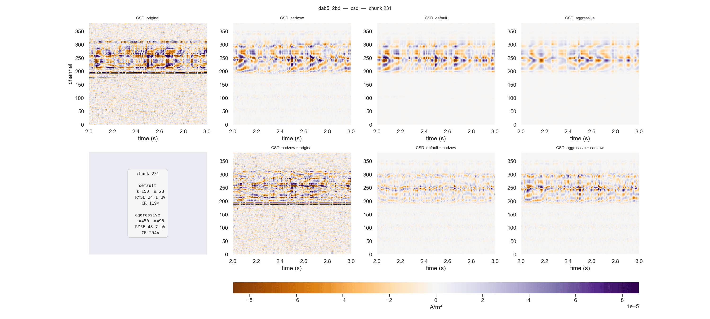
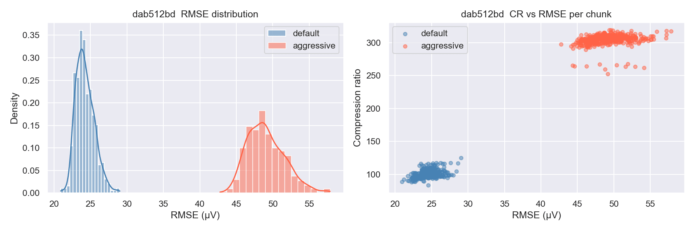

# lfpack — LFP codec for Neuropixels recordings

<p align="center">
  
</p>

Lossy codec for local-field-potential (LFP) recordings from Neuropixels probes.
Seven-stage pipeline: bad-channel detection → highpass → decimation → dephasing → CAR → Cadzow denoising → adaptive SVD + wavelet-packet thresholding.
Achieves **>100× compression** with median RMSE < 25 µV.

---

## Installation

```bash
pip install lfpack
```

or with uv:

```bash
uv add lfpack
```

Development install:

```bash
git clone https://github.com/int-brain-lab/lfpack
cd lfpack
uv sync --extra dev
```

---

## Getting started

```python
from lfpack import compress_bin_to_h5, LFPackReader

# Decimate, denoise, and compress a raw LFP binary in one call
compress_bin_to_h5('path/to/lf.cbin', 'lf.h5')

# Decode on demand — same interface as spikeglx.Reader
sr = LFPackReader('lf.h5')
traces = sr[0:1000]      # (1000, n_channels) float32, volts
geometry = sr.geometry   # {'x': ..., 'y': ...} channel positions
```

---

## Example — PID `dab512bd` (NP1, 61 min, 384 ch)

### Parameter sets

| Parameter set | ε (SVD) | α (WP) | File size | CR (median) | RMSE median | RMSE p95 |
|---|---|---|---|---|---|---|
| **default** | 150 | 28 | 19 MB | **97×** | 24 µV | 27 µV |
| **aggressive** | 450 | 96 | 9 MB | **305×** | 49 µV | 54 µV |

### LFP voltage density — original · Cadzow · default · aggressive


*Top row: original resampled → Cadzow denoised → default compressed → aggressive compressed.
Bottom row: residuals (compressed − Cadzow) for default and aggressive.  Colormap ±300 µV.*

### Current-source density — original · Cadzow · default · aggressive



*Same layout as above but displayed as CSD (second spatial derivative).
Colormap in A/m³.*

### RMSE distribution and CR vs RMSE scatter



---

# LFP compression — methods and notes

## Pipeline overview

Seven sequential stages applied to raw NP1/NP2 LFP data (384 ch, 2500 Hz):

```
raw LFP (2500 Hz)
  └─ 1. Bad-channel detection  → per-channel labels (dead / noisy / outside brain)
  └─ 2. Highpass filter        → 2 Hz zero-phase 3rd-order Butterworth
  └─ 3. Decimation             → 250 Hz (FIR anti-aliasing, bad channels interpolated)
  └─ 4. Dephasing              → sample-shift correction (NP1 only)
  └─ 5. CAR                    → median common-average reference subtracted
  └─ 6. Cadzow denoising       → spatially denoised LFP
  └─ 7. SVD + WP               → rank-r approximation → sparse coefficient storage
```

---

## Stage 1 — Bad-channel detection

Automatic per-channel quality labels (0 = good, 1 = dead, 2 = noisy, 3 = outside brain)
are assigned via `ibldsp.voltage.detect_bad_channels_cbin` before decimation.
Bad channels are interpolated from neighbours before the SVD step, preventing incoherent
channels from inflating the noise-floor estimate and forcing a higher rank.

---

## Stage 2 — Highpass filter

3rd-order zero-phase Butterworth highpass at 2 Hz (`scipy.signal.sosfiltfilt`) removes
slow DC drifts before decimation.

---

## Stage 3 — Decimation (2500 → 250 Hz)

FIR anti-aliasing (`scipy.signal.decimate`, Q=10) applied in overlapping chunks
(512-sample filter warmup halo each side) to avoid edge transients.

---

## Stage 4 — Dephasing

Sample-shift correction for NP1 probes: each channel is phase-rotated in the frequency
domain by `exp(1j × angle × sample_shift)` to align all channels to a common time
reference before CAR.

---

## Stage 5 — CAR (common-average reference)

Median across all good channels is subtracted sample-by-sample.  The removed trace is
saved alongside the compressed file as `<stem>_car.npy` for later inspection or
re-addition.

---

## Stage 6 — Cadzow denoising

Spatial denoising via the Cadzow algorithm (`ibldsp.cadzow.cadzow_denoiser`) run in
640-sample chunks with 64-sample halos (processed window = 768 = 3 × 256, FFT-optimal).

Parameters used: `rank=5, niter=1, fmax=None, nswx=64, gap_threshold=2.0, ppca_k=2.0`

---

## Stage 7 — Adaptive SVD + wavelet-packet thresholding

### Adaptive SVD

Each 2048-sample chunk is extended by 128-sample guard bands on each side before SVD.
Rank *r* is selected adaptively:

```
r = #{k : sv[k] > epsilon × sigma_noise}
```

where `sigma_noise` is the median of the upper half of the singular-value distribution
(restricted to `sv > 1e-4 × sv[0]` to exclude dead channels).

The stored quantity is `U_scaled = U[:, :r] * sv[:r]`  (shape `nc × r`).

### Wavelet-packet thresholding

Each of the *r* temporal rows `Vh[k, :]` is decomposed with a db4 wavelet-packet tree
(level 5).  Per-component hard thresholding:

```
tau_k = alpha × sigma_noise / sv[k]
```

Larger singular values (dominant spatial modes) receive a lower threshold, preserving
more temporal detail.

### Theoretical compression-ratio formula

```
cr_total = (nc × ns) / (r × nc + n_kept)
cr_wp    = (r × ns)  / n_kept              # WP contribution to Vh rows only
cr_svd   = (nc × ns) / (r × (nc + ns))    # SVD-only CR (no WP)
```

---

## HDF5 storage optimisations

### Sparse Vh_hat

Rather than storing the full `(r, n_wp_slots)` float32 array and relying on gzip to
compress zero runs, Vh_hat is stored as two contiguous 1-D datasets:

| Dataset | dtype | length | description |
|---|---|---|---|
| `vh_indices` | int32 | n_kept | flat indices of non-zero coefficients |
| `vh_values` | float32 | n_kept | corresponding coefficient values |

`vh_shape` is stored as a group attribute so the dense array can be reconstructed on
read.

### Shuffle filter on U_scaled

The HDF5 `shuffle` filter is applied to `U_scaled` before gzip.  It reorders bytes by
significance (all MSBs together, then mantissa bytes), improving gzip compression on
dense float32 data.