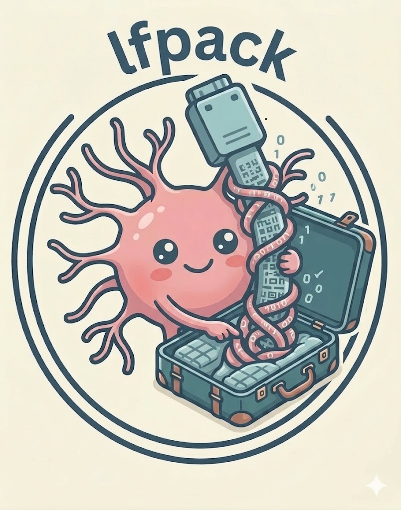
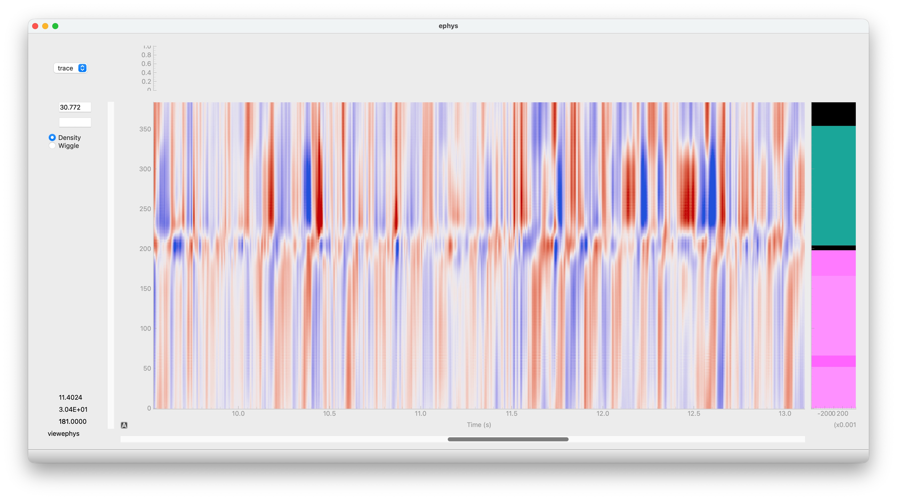

# lfpack — LFP codec for Neuropixels recordings

<p align="center">
  
</p>

Lossy, random-access codec for Neuropixels LFP. A recording is cleaned, decimated to 250 Hz
and denoised, then stored in an HDF5 file of about **1.5 %** of the decimated float32 data
(~20 MB per hour of 384-channel NP1) and read back through a drop-in `spikeglx.Reader`.

```bash
pip install lfpack
```

```python
from lfpack import compress_bin_to_h5, LFPackReader

compress_bin_to_h5("recording.lf.cbin", "recording.lf.h5")
traces = LFPackReader("recording.lf.h5")[0:1000]   # (1000, nc) float32, volts
```

> **IBL Brain-Wide Map LFP dataset**: 699 recordings, session-clock aligned, browsable online.
> [How to access →](https://int-brain-lab.github.io/lfpack/how-to/bwm-dataset.html)

[`viewephys`](https://github.com/int-brain-lab/viewephys) opens lfpack files directly
(`viewephys -f recording.h5`), with brain-region colouring:

<p align="center">
  
</p>

Documentation: **https://int-brain-lab.github.io/lfpack/**. Questions and bug reports:
[GitHub issues](https://github.com/int-brain-lab/lfpack/issues).
