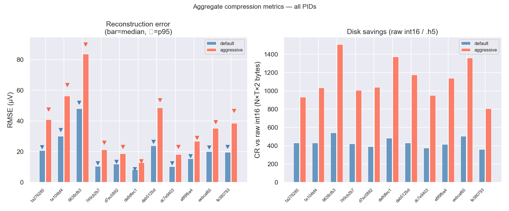

Compression results across 11 IBL Neuropixels (NP1) recordings spanning a range of brain
regions and recording quality.  Each recording was compressed with two parameter sets:

| Label | ε | α | Typical CR |
|---|---|---|---|
| **default** | 150 | 28 | ~350× |
| **aggressive** | 450 | 96 | ~750× |

Click any figure to open it full-size with keyboard navigation.

---

## Aggregate metrics

RMSE distribution (bar = median, ▽ = p95) and compression ratio across all recordings.

{.lightbox}

---

## Voltage density

Columns within each panel: original → Cadzow → default → aggressive (top row), with
residuals vs the previous stage (bottom row).

{group="density" .lightbox}

{group="density" .lightbox}

{group="density" .lightbox}

{group="density" .lightbox}

{group="density" .lightbox}

{group="density" .lightbox}

{group="density" .lightbox}

{group="density" .lightbox}

{group="density" .lightbox}

{group="density" .lightbox}

{group="density" .lightbox}

