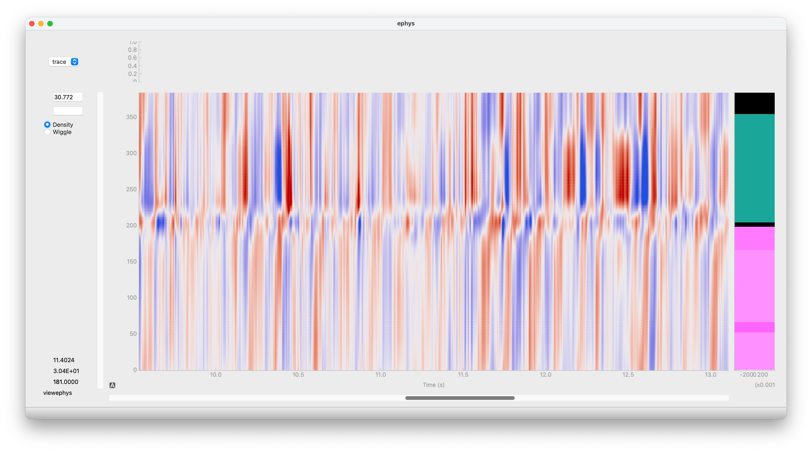
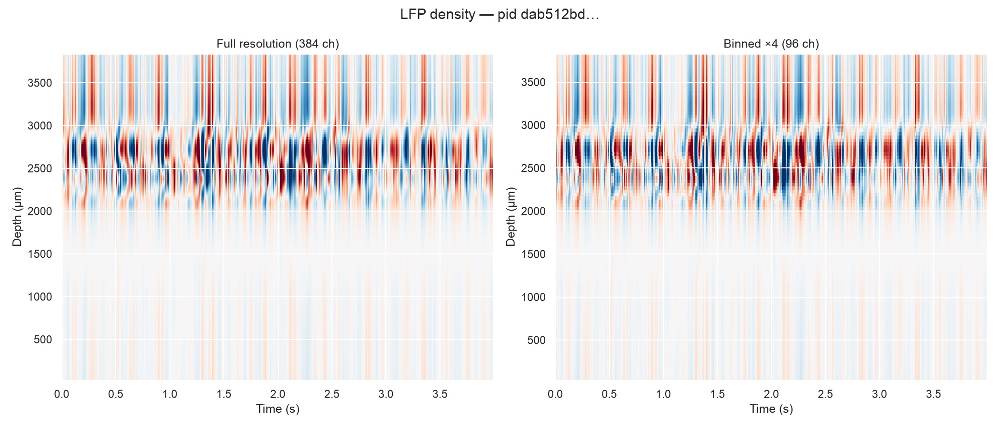

The IBL Brain-Wide Map (BWM) LFP dataset is distributed as a 16GB `.h5` file
containing 699 individual recordings of 384 channels each.


::: {.callout-important}
## Before you start

- **Align with trial events via `sr.times`** — each recording stores a sync-corrected
  session clock; always use `sr.times` rather than a manual `np.arange / sr.fs` when
  matching LFP samples to spike times or trial events.
  See [Session-clock times](#session-clock-times).

- **Use binned reads for brainwide sweeps** — looping over all 699 recordings at full
  384-channel resolution is memory-intensive. Pass `bin_channels=4` to reduce each
  recording to 96 spatial bins with acceptable loss of depth coverage.
  See [Binned-channel reads](#binned-channel-reads).
:::

## Visualise with viewephys

```python
from lfpack import LFPackReader
from viewephys.gui import viewephys
from iblatlas.atlas import BrainRegions

file_lfpack = "lf_compressed_all_bwm.h5"
pid = 'dab512bd-a02d-4c1f-8dbc-9155a163efc0'

sr = LFPackReader(file_lfpack, recording=pid)
traces = sr[:5000, :].T         # (nc, n_samples)
eqc = viewephys(traces, fs=sr.fs, channels=sr.channels, br=br)   # viewephys expects (nc, n_samples)
```

{fig-alt="viewephys density view showing 384-channel LFP data with brain region colour bar on the right" .lightbox}


## Prerequisites

```bash
uv pip install lfpack viewephys one-api iblatlas
```

## Download

From inside the `ibl-ai-agent` repository:

```bash
uv run python scripts/download_datasets.py --lfp
```

This downloads `lf_compressed_all_bwm.h5` (~14 GB) into `reports/datasets/bwm_lfp/`
and writes the path into `data_locations.local.yaml` automatically.

Or, from Python (no AWS credentials needed — uses the ONE public S3 helper):

```python
from one.remote.aws import s3_download_file

s3_download_file(
    source="resources/ibl-agent-data/lf_compressed_all_bwm.h5",
    destination="lf_compressed_all_bwm.h5",
)
```

`s3_download_file` defaults to the IBL public bucket, shows a tqdm progress bar,
and skips the download if the local file already has the correct size.

## List recordings

Each file contains one entry per BWM probe. Recording identifiers are named after the probe identifier UUID `pid`.

```python
from lfpack import LFPackReader

recordings = LFPackReader.recordings("lf_compressed_all_bwm.h5")
print(f"{len(recordings)} recordings")
print(recordings[:3])
# 699 recordings
# ['00a824c0-e060-495f-9ebc-79c82fef4c67', '00a96dee-1e8b-44cc-9cc3-aca704d2b594', '00c425fd-ec3e-4cd2-b8af-c0bc0c4bdd44']
```

## Read a single recording

```python
from lfpack import LFPackReader

file_lfpack = "lf_compressed_all_bwm.h5"
pid = 'dab512bd-a02d-4c1f-8dbc-9155a163efc0'

sr = LFPackReader(file_lfpack, recording=pid)

# First 10 seconds — shape (2500, nc), float32, volts
traces = sr[: int(10 * sr.fs)].T

print(f"Duration:    {sr.ns / sr.fs:.1f} s")
print(f"Channels:    {sr.nc}")
print(f"Sample rate: {sr.fs} Hz")   # 250 Hz (decimated from 2500 Hz)
print(f"Shape:       {traces.shape}")

# Duration:    3668.9 s
# Channels:    384
# Sample rate: 250.00252518761928 Hz
# Shape:       (384, 2500)
```

`LFPackReader` is a drop-in for `spikeglx.Reader`.
Slicing decompresses only the requested chunks — the full file is never loaded into memory.

## Binned-channel reads

Adjacent channels are spatially correlated at LFP frequencies.
Passing `bin_channels` sums neighbouring channels during decompression, reducing
memory use. A factor of 4 takes 384 channels down to 96 while keeping depth resolution useful for LFP.

```python
from lfpack import LFPackReader

file_lfpack = "lf_compressed_all_bwm.h5"
pid = 'dab512bd-a02d-4c1f-8dbc-9155a163efc0'

sr = LFPackReader(file_lfpack, recording=pid, bin_channels=4)

traces = sr[:, :]      # (ns, 96) — full recording, 96 spatial bins
print(sr.nc)           # 96
print(sr.geometry["y"])           # mean depth of each 4-channel group
print(sr.geometry_full['binned_channel_index'])  # spatial mapping of the original 384 channels into the 96 binned ones
```

{fig-alt="Side-by-side LFP density plots at full and 4x binned channel resolution" .lightbox}

## Session-clock times

`sr.times` returns a `(ns,)` array of session-clock timestamps (seconds) for every
LFP sample, derived from the sync signal stored during compression.
Use it to align LFP traces with trial events or spike times:

```python
from lfpack import LFPackReader
import numpy as np

file_lfpack = "lf_compressed_all_bwm.h5"
pid = 'dab512bd-a02d-4c1f-8dbc-9155a163efc0'

sr = LFPackReader(file_lfpack, recording=pid)

n = int(10 * sr.fs)
traces = sr[:n, :]      # (n_samples, nc) — first 10 s
t = sr.times[:n]        # (n_samples,)    — session-clock seconds

# Align with trial events loaded via ONE
# stim_on = trials['stimOn_times']   # already in session-clock seconds
# idx = np.searchsorted(t, stim_on)  # nearest LFP sample for each stimulus onset
```