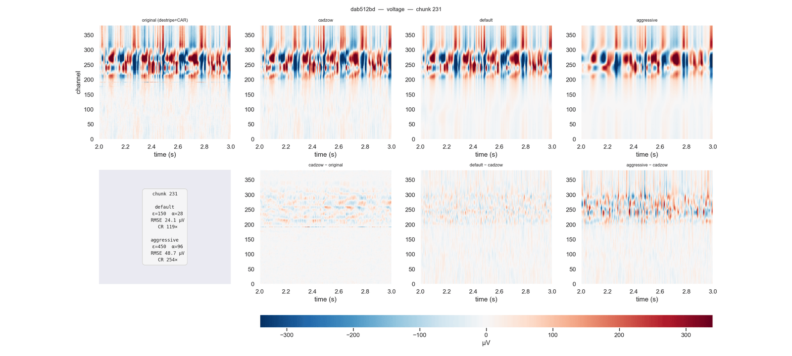

**lfpack** compresses raw Neuropixels LFP recordings at **>100× compression** with median RMSE < 25 µV, using an 8-stage pipeline followed by adaptive SVD + wavelet-packet thresholding.


## Documentation

| Section | Content |
|---|---|
| [Tutorial](tutorials/first-compression.qmd) | Install, compress, and read your first recording |
| [How-To: Binned reads](how-to/binned-reads.qmd) | Memory-efficient channel-binned access |
| [How-To: Multi-recording](how-to/multi-recording.qmd) | Work with multi-recording HDF5 files |
| [Reference: API](reference/index.qmd) | Full API reference |
| [Reference: HDF5 format](reference/hdf5-layout.qmd) | File format specification |
| [Explanation: Pipeline](explanation/pipeline.qmd) | Design rationale for each pipeline stage |


## Quick start

```bash
pip install lfpack
```

```python
from lfpack import compress_bin_to_h5, LFPackReader

# Compress a raw LFP binary
compress_bin_to_h5("recording.lf.cbin", "recording.lf.h5")

# Read back on demand — same interface as spikeglx.Reader
sr = LFPackReader("recording.lf.h5")
traces = sr[0:1000]      # (1000, n_channels) float32, volts
```

## Benchmark — IBL PID `dab512bd` (NP1, 61 min, 384 ch, original: 6.5 GB)

| Parameter set | ε (SVD) | α (WP) | File size | CR (median) | RMSE median | RMSE p95 |
|---|---|---|---|---|---|---|
| **default** | 150 | 28 | 19 MB | **350×** | 24 µV | 27 µV |
| **aggressive** | 450 | 96 | 9 MB | **745×** | 49 µV | 54 µV |


